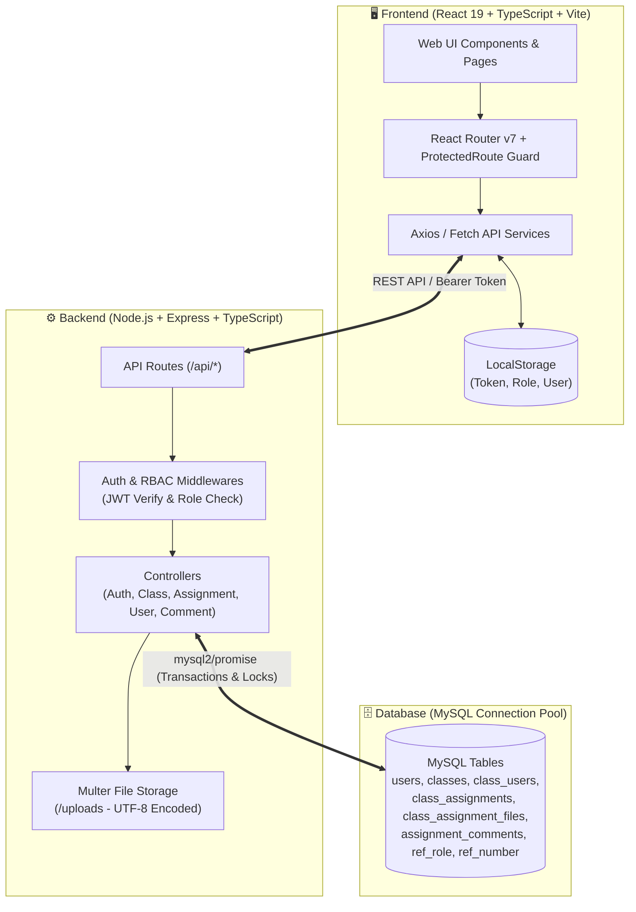

# 🎓 Classroom Hub
---

## 📖 ภาพรวมของระบบ (Project Overview)

**Classroom Hub** เป็นระบบเว็บแอปพลิเคชันแบบครบวงจร (Full-Stack Web Application) ที่พัฒนาขึ้นเพื่อสนับสนุนการเรียนการสอน การจัดเก็บและจัดแสดงผลงานของนิสิต เอกสารประกอบการเรียน รวมถึงการแลกเปลี่ยนข้อเสนอแนะระหว่างอาจารย์และนิสิตในรูปแบบสองทิศทาง (Interactive Two-Way Feedback)

ระบบถูกออกแบบโดยเน้นที่ความปลอดภัย ความเสถียร และความยืดหยุ่นในการใช้งาน โดยใช้การควบคุมสิทธิ์ตามบทบาทผู้ใช้แบบหลายระดับ (**Role-Based Access Control - RBAC**), การเข้ารหัสความปลอดภัย, และระบบป้องกันความปลอดภัย 2 ชั้น (Two-Layer Route Guards) ทั้งในฝั่ง Frontend และ Backend

---

## 📑 สารบัญ (Table of Contents)

1. [✨ ฟีเจอร์หลักและความสามารถของระบบ (Key Features)](#-ฟีเจอร์หลักและความสามารถของระบบ-key-features)
2. [👥 ตารางสิทธิ์และการเข้าถึงตามบทบาท (Role & Permissions Matrix)](#-ตารางสิทธิ์และการเข้าถึงตามบทบาท-role--permissions-matrix)
3. [🏛️ สถาปัตยกรรมและการทำงานของระบบ (System Architecture & Flow)](#️-สถาปัตยกรรมและการทำงานของระบบ-system-architecture--flow)
4. [🛠️ เทคโนโลยีและเครื่องมือที่ใช้ (Tech Stack)](#️-เทคโนโลยีและเครื่องมือที่ใช้-tech-stack)
5. [📁 โครงสร้างโปรเจกต์ (Project Structure)](#-โครงสร้างโปรเจกต์-project-structure)
6. [⚙️ สิ่งที่ต้องเตรียมก่อนติดตั้ง (Prerequisites)](#️-สิ่งที่ต้องเตรียมก่อนติดตั้ง-prerequisites)
7. [🗄️ การติดตั้งฐานข้อมูล (Database Setup)](#️-การติดตั้งฐานข้อมูล-database-setup)
8. [🚀 ขั้นตอนการติดตั้งและรันระบบ (Step-by-Step Installation)](#-ขั้นตอนการติดตั้งและรันระบบ-step-by-step-installation)
   - [การตั้งค่า Backend](#1-การติดตั้งและรัน-backend-nodejs--express--typescript)
   - [การตั้งค่า Frontend](#2-การติดตั้งและรัน-frontend-react-19--vite)
   - [ตัวอย่างบัญชีทดสอบในระบบ (Default Test Accounts)](#3-ตัวอย่างบัญชีผู้ใช้สำหรับทดสอบระบบ)
9. [🔌 เอกสารคู่มือ API (Backend API Reference)](#-เอกสารคู่มือ-api-backend-api-reference)
10. [🛡️ มาตรการความปลอดภัยและความเสถียร (Security & Reliability)](#️-มาตรการความปลอดภัยและความเสถียร-security--reliability)
11. [❓ การแก้ไขปัญหาที่พบบ่อย (Troubleshooting & FAQs)](#-การแก้ไขปัญหาที่พบบ่อย-troubleshooting--faqs)
12. [📄 สัญญาอนุญาต (License)](#-สัญญาอนุญาต-license)

---

## ✨ ฟีเจอร์หลักและความสามารถของระบบ (Key Features)

### 🔐 1. ระบบยืนยันตัวตนและการจัดการเซสชัน (Authentication & SSO)
- **Local Authentication:** รองรับการลงทะเบียนและเข้าสู่ระบบด้วย Username/Email ร่วมกับรหัสผ่านที่เข้ารหัสความปลอดภัยด้วย **Bcrypt**
- **Single Sign-On (OAuth 2.0):** รองรับการเข้าสู่ระบบผ่าน **Google** และ **Microsoft Graph API** พร้อมระบบผูกบัญชีเดิมอัตโนมัติ (Account Linking) ตามอีเมล
- **Interactive Social Demo Mode:** มีหน้าต่างจำลองการล็อกอินผ่าน Google / Microsoft เพื่อความสะดวกรวดเร็วในการทดสอบและนำเสนอผลงาน
- **Auto-Generated Unique User ID:** ระบบออกรหัสผู้ใช้งานตามลำดับอัตโนมัติ (เช่น `US001`, `US002`) พร้อม Database Row Lock เพื่อป้องกัน Race Condition

### 📚 2. ระบบจัดการรายวิชา (Classroom Management)
- **Course Catalog & Real-Time Search:** ค้นหารายวิชาได้แบบ Real-time พร้อมระบบ Debounce Search และแบ่งหน้าข้อมูล (Pagination)
- **Course CRUD:** สร้าง แก้ไข และลบข้อมูลรายวิชา (รหัสวิชา, ชื่อวิชา, รายละเอียด) เฉพาะอาจารย์เจ้าของวิชาและ Admin
- **Teacher Course Dashboard:** หน้ารายการวิชาที่อาจารย์รับผิดชอบ เพื่อให้เข้าถึงและตรวจงานได้อย่างรวดเร็ว

### 👥 3. ระบบสมาชิกและการลงทะเบียนรายวิชา (Class Members Management)
- **Member Enrollment:** อาจารย์ผู้สอนสามารถดึงรายชื่อผู้ใช้ที่ยังไม่ได้เข้าวิชามาเพิ่มเป็นนิสิตในรายวิชาได้ทันที
- **Auto-Role Promotion:** เมื่อเพิ่มผู้ใช้ที่เป็น "ผู้ใช้ทั่วไป (Guest)" เข้าสู่รายวิชา ระบบสามารถปรับบทบาทให้เป็น "นิสิต (Student)" ให้อัตโนมัติ
- **Multi-Admin Auto Sync:** เพิ่มสิทธิ์ Admin ทุกคนในระบบเข้าสู่รายวิชาที่สร้างขึ้นโดยอัตโนมัติ เพื่อความสะดวกในการกำกับดูแล

### 📂 4. ระบบคลังผลงานและเอกสารการเรียนรู้ (Assignments & Portfolio Hub)
- **Multi-File Upload:** อัปโหลดไฟล์แนบผลงานได้พร้อมกันหลายไฟล์ รองรับไฟล์เอกสาร PDF, รูปภาพ, สไลด์ ฯลฯ
- **UTF-8 Thai Filename Handling:** ระบบแปลงและจัดเก็บชื่อไฟล์ภาษาไทยอย่างถูกต้อง ป้องกันปัญหาตัวอักษรเพี้ยนหรืออ่านไม่ออก
- **Categorization & External Links:** จัดหมวดหมู่ผลงาน (Web, Application, Web Application, IoT, Document, Other) พร้อมแนบลิงก์ภายนอก เช่น GitHub, Figma หรือ Live Demo
- **File Download Security:** ตรวจสอบสิทธิ์การเข้าถึงไฟล์แนบ โดยอนุญาตให้ดาวน์โหลดเฉพาะสมาชิกในรายวิชาและผู้ดูแลระบบเท่านั้น

### 💬 5. ระบบสนทนาและข้อเสนอแนะ (Collaborative Feedback & Comments)
- **Interactive Feedback Loop:** เปิดโอกาสให้นิสิตเจ้าของผลงานและอาจารย์ผู้สอนสนทนา แลกเปลี่ยนข้อเสนอแนะ และให้คำแนะนำ
- **Comment Lifecycle:** สมาชิกสามารถเพิ่มข้อความ แก้ไขข้อความของตนเอง หรือลบความคิดเห็นได้ โดยอาจารย์และแอดมินมีสิทธิ์ร่วมดูแลความเรียบร้อย

### 🛡️ 6. ระบบผู้ดูแลระบบและจัดการสิทธิ์ (Admin User Management)
- **User Directory & Filter:** แสดงรายการผู้ใช้งานทั้งหมดในระบบ พร้อมระบบค้นหาและแสดงสถานะ
- **Role Switching:** ปรับเปลี่ยนบทบาทผู้ใช้แบบไดนามิก (Admin, Teacher, Student, Guest)
- **Account Activation Toggle:** ระงับหรือเปิดการใช้งานบัญชีผู้ใช้ได้ทันที
- **Self-Lockout Prevention:** มีกลไกป้องกันไม่ให้แอดมินเผลอเปลี่ยนสิทธิ์ตนเอง หรือระงับบัญชีตนเองจนล็อกตัวเองออกจากระบบ

---

## 👥 ตารางสิทธิ์และการเข้าถึงตามบทบาท (Role & Permissions Matrix)

ระบบแบ่งผู้ใช้ออกเป็น 4 ระดับบทบาทอย่างชัดเจน เพื่อความปลอดภัยและความเป็นระเบียบของข้อมูล:

| ความสามารถของระบบ (Feature / Action) | Admin <br> `(Role 0)` | Teacher <br> `(Role 1)` | Student <br> `(Role 2)` | Guest <br> `(Role 3)` |
| :--- | :---: | :---: | :---: | :---: |
| 🔍 ดูและค้นหาแคตตาล็อกรายวิชาสาธารณะ | ✅ | ✅ | ✅ | ✅ |
| 📖 ดูรายละเอียดรายวิชาและรายการผลงาน | ✅ | ✅ | ✅ | ❌ |
| ➕ สร้างรายวิชาใหม่ (Create Class) | ✅ | ✅ | ❌ | ❌ |
| ✏️ แก้ไข / ลบรายวิชา | ✅ (ทุกวิชา) | ✅ (เฉพาะวิชาของตน) | ❌ | ❌ |
| 👥 เพิ่ม / ลบ สมาชิกในรายวิชา | ✅ | ✅ (เฉพาะวิชาของตน) | ❌ | ❌ |
| 📤 ส่งผลงาน / อัปโหลดไฟล์ในรายวิชา | ✅ | ✅ | ✅ (เฉพาะวิชาที่ลงเรียน) | ❌ |
| 📥 ดาวน์โหลดไฟล์แนบผลงาน | ✅ | ✅ | ✅ (เฉพาะวิชาที่ลงเรียน) | ❌ |
| 📝 แก้ไข / ลบ ผลงาน | ✅ (ทุกผลงาน) | ✅ (เฉพาะผลงานในวิชาตน) | ✅ (เฉพาะผลงานของตน) | ❌ |
| 💬 แสดงความคิดเห็นในผลงาน | ✅ | ✅ (เฉพาะผลงานในวิชาตน) | ✅ (เฉพาะผลงานของตน) | ❌ |
| ⚙️ ปรับระดับสิทธิ์ผู้ใช้ (Change Role) | ✅ (เปลี่ยนได้ทุก Role) | ✅ (ปรับเป็น Student/Guest) | ❌ | ❌ |
| 🚫 ระงับ / เปิดการใช้งานบัญชี (Ban/Active) | ✅ | ❌ | ❌ | ❌ |

---

## 🏛️ สถาปัตยกรรมและการทำงานของระบบ (System Architecture & Flow)

ระบบทำงานบนสถาปัตยกรรมแบบ Client-Server แยกฝั่ง Frontend และ Backend อย่างชัดเจน และสื่อสารกันผ่าน RESTful JSON API:



### แผนผังโครงสร้างฐานข้อมูล (Database Schema Overview)

- **`users`** : เก็บข้อมูลผู้ใช้งาน รหัสผู้ใช้ อีเมล รหัสผ่าน (Hashed) บทบาท (`role_flg`) บัญชี Social OAuth และสถานะการใช้งาน
- **`ref_role`** : ตารางอ้างอิงชื่อบทบาท (0: ผู้ดูแลระบบ, 1: อาจารย์, 2: นิสิต, 3: ผู้ใช้ทั่วไป)
- **`classes`** : จัดเก็บข้อมูลรายวิชา รหัสวิชา ชื่อวิชา รายละเอียด และผู้สร้างวิชา
- **`class_users`** : จัดเก็บความสัมพันธ์การเป็นสมาชิกในรายวิชาของแต่ละผู้ใช้
- **`class_assignments`** : จัดเก็บข้อมูลผลงาน ชื่องาน รายละเอียด ลิงก์ภายนอก ประเภทงาน และผู้ส่ง
- **`class_assignment_files`** : จัดเก็บชื่อไฟล์ ขนาด ประเภท และ Path ของไฟล์แนบในแต่ละผลงาน
- **`assignment_comments`** : จัดเก็บความคิดเห็น ข้อเสนอแนะ และการแลกเปลี่ยนระหว่างผู้ใช้
- **`ref_number`** : จัดเก็บเลขรันอัตโนมัติสำหรับ User Code (`US001`...) ป้องกันรหัสซ้ำ

---

## 🛠️ เทคโนโลยีและเครื่องมือที่ใช้ (Tech Stack)

### **Frontend**
- **Core Library:** [React 19.2](https://react.dev/) + [TypeScript 5.9](https://www.typescriptlang.org/)
- **Build Tool / Bundler:** [Vite 7.2](https://vitejs.dev/)
- **Routing Engine:** [React Router v7](https://reactrouter.com/)
- **Iconography:** [React Icons](https://react-icons.github.io/react-icons/) (Feather Icons Pack)
- **Notifications:** [React Toastify](https://fkhadra.github.io/react-toastify/)
- **Styling Architecture:** Modern Vanilla CSS Design System (CSS Custom Properties, Glassmorphism, Responsive Grid & Flexbox)

### **Backend**
- **Runtime Environment:** [Node.js](https://nodejs.org/)
- **Web Framework:** [Express 5.2](https://expressjs.com/)
- **Language & Compiler:** [TypeScript](https://www.typescriptlang.org/) (รันผ่าน `ts-node-dev`)
- **Database Driver:** [mysql2/promise](https://github.com/sidorares/node-mysql2) (Connection Pooling, Prepared Statements, Database Transactions)
- **Authentication & Encryption:** [JSON Web Token (JWT)](https://jwt.io/) + [Bcrypt.js](https://github.com/dcodeIO/bcrypt.js)
- **Multipart Form & File Upload:** [Multer](https://github.com/expressjs/multer) พร้อม Custom Buffer Decoding สำหรับชื่อไฟล์ภาษาไทย
- **Security & Config:** [CORS](https://github.com/expressjs/cors), [Dotenv](https://github.com/motdotla/dotenv)

---

## 📁 โครงสร้างโปรเจกต์ (Project Structure)

```text
final/
├── PJHub_Data.zip                   # 📦 ไฟล์สำรองฐานข้อมูลพร้อมข้อมูลเริ่มต้น (Database Backup)
├── README.md                        # 📖 คู่มือการติดตั้งและเอกสารอธิบายระบบฉบับสมบูรณ์
│
├── backend/                         # ⚙️ โค้ดส่วน Backend API (Node.js + Express + TypeScript)
│   ├── .env                         # ไฟล์ตัวแปรสภาพแวดล้อมจริง (Database, JWT Secret, Port)
│   ├── .env.example                 # ตัวอย่างการตั้งค่าตัวแปรสภาพแวดล้อม
│   ├── package.json                 # รายการ Dependencies และคำสั่งรันของ Backend
│   ├── tsconfig.json                # ค่า Configuration ของ TypeScript
│   ├── uploads/                     # โฟลเดอร์จัดเก็บไฟล์แนบผลงานที่อัปโหลดเข้าสู่ระบบ
│   └── src/
│       ├── index.ts                 # จุดเริ่มต้นของ Server และการเชื่อมต่อ Middleware/Routes
│       ├── db.ts                    # Connection Pool และ Schema Initializer ของ MySQL
│       ├── controllers/             # คอนโทรลเลอร์ควบคุม Business Logic ของแต่ละโมดูล
│       │   ├── auth.controller.ts       # ระบบ Login, Register, Google/Microsoft OAuth, Profile
│       │   ├── class.controller.ts      # ระบบ CRUD รายวิชา และการค้นหา
│       │   ├── classUser.controller.ts  # จัดการสมาชิกในรายวิชา และการดึงรายชื่อ
│       │   ├── assignment.controller.ts # สร้าง/แก้ไข/ลบผลงาน, ดาวน์โหลดไฟล์แนบ
│       │   ├── comment.controller.ts    # เพิ่ม/แก้ไข/ลบ ความคิดเห็นในผลงาน
│       │   └── user.controller.ts       # ปรับระดับสิทธิ์ (Role) และระงับ/เปิดบัญชีผู้ใช้
│       ├── middlewares/             # มิดเดิลแวร์สำหรับตรวจสอบสิทธิ์
│       │   ├── auth.middlewares.ts      # ตรวจสอบ JWT Bearer Token และดึงข้อมูลผู้ใช้
│       │   └── role.middlewares.ts      # ตรวจสอบระดับ Role เพื่อป้องกัน Unauthorized Access
│       ├── routes/                  # เส้นทาง API Endpoints ทั้งหมด
│       │   ├── auth.routes.ts           # /api/auth
│       │   ├── class.routes.ts          # /api/class
│       │   ├── classUser.routes.ts      # /api/class-user
│       │   ├── assignment.routes.ts     # /api/assignment
│       │   ├── comment.routes.ts        # /api/comments
│       │   └── user.routes.ts           # /api/user
│       └── types/                   # Type Declarations (เช่น ขยาย Express Request Type)
│
└── frontend/                        # 🖥️ โค้ดส่วน Frontend Web App (React 19 + TypeScript + Vite)
    ├── index.html                   # หน้า HTML หลักของ Single Page Application
    ├── package.json                 # รายการ Dependencies และคำสั่งรันของ Frontend
    ├── tsconfig.json                # ค่า Configuration ของ TypeScript ฝั่งหน้าบ้าน
    ├── vite.config.ts               # การตั้งค่า Vite Build Tool
    └── src/
        ├── App.tsx                  # จุดรวม Routing และ Route Guards (<ProtectedRoute>)
        ├── main.tsx                 # Entry Point ของ React Application
        ├── components/              # คอมโพเนนต์ที่ใช้ร่วมกัน
        │   └── ProtectedRoute.tsx       # คอมโพเนนต์กรองสิทธิ์ตาม Role และสถานะการล็อกอิน
        ├── layouts/                 # โครงร่างหน้าจอหลัก
        │   └── MainLayout.tsx           # Layout หลักพร้อม Sidebar, User Header, Navigation
        ├── pages/                   # หน้าจอแสดงผลทั้งหมดของระบบ
        │   ├── Home.tsx                 # หน้าแรก: แสดงแคตตาล็อกรายวิชา และช่องค้นหา
        │   ├── Login.tsx                # หน้าเข้าสู่ระบบ (รองรับ Local, Social Demo, OAuth)
        │   ├── Register.tsx             # หน้าสมัครสมาชิกใหม่
        │   ├── UserManagement.tsx       # หน้าระบบจัดการผู้ใช้ (เฉพาะ Admin)
        │   ├── class/                   # หน้าจอเกี่ยวกับรายวิชา
        │   │   ├── CreateClass.tsx          # หน้าสร้างรายวิชาใหม่
        │   │   ├── ClassDetail.tsx          # หน้ารายละเอียดวิชา และรายการผลงาน
        │   │   ├── ClassEdit.tsx            # หน้าแก้ไขข้อมูลรายวิชา
        │   │   ├── ClassUserManagement.tsx  # หน้าจัดการสมาชิกในรายวิชา
        │   │   └── TeacherClassManagement.tsx # หน้ารายวิชาที่อาจารย์รับผิดชอบ
        │   └── assignment/              # หน้าจอเกี่ยวกับผลงาน
        │       ├── CreateAssignment.tsx     # หน้าส่งผลงานใหม่ พร้อมอัปโหลดไฟล์
        │       ├── AssignmentDetail.tsx     # หน้ารายละเอียดผลงาน ไฟล์แนบ และความคิดเห็น
        │       ├── AssignmentManagement.tsx # หน้ารายการผลงานของตนเอง
        │       └── AssignmentEdit.tsx       # หน้าแก้ไขข้อมูลผลงานและไฟล์แนบ
        ├── services/                # บริการเชื่อมต่อ API ไปยัง Backend
        │   ├── auth.service.ts          # ฟังก์ชัน Login, Register, OAuth, Profile
        │   ├── class.service.ts         # ฟังก์ชันจัดการรายวิชา
        │   ├── classUser.service.ts     # ฟังก์ชันจัดการสมาชิกในรายวิชา
        │   ├── assignment.service.ts    # ฟังก์ชันจัดการผลงานและดาวน์โหลดไฟล์
        │   ├── comment.service.ts       # ฟังก์ชันจัดการความคิดเห็น
        │   └── user.service.ts          # ฟังก์ชันดึงรายชื่อผู้ใช้และจัดการสิทธิ์
        └── css/                     # สไตล์ชีตทั้งหมดของระบบ
```

---

## ⚙️ สิ่งที่ต้องเตรียมก่อนติดตั้ง (Prerequisites)

เพื่อให้ระบบสามารถติดตั้งและทำงานได้อย่างสมบูรณ์ กรุณาตรวจสอบซอฟต์แวร์ในเครื่องของคุณ:

1. **Node.js:** แนะนำเวอร์ชัน **`v18.x`** หรือ **`v20.x LTS`** ขึ้นไป ([ดาวน์โหลด Node.js](https://nodejs.org/))
2. **Package Manager:** **npm** (ติดตั้งมาพร้อมกับ Node.js) หรือ pnpm / yarn
3. **Database Server:** **MySQL Server 8.0+** หรือโปรแกรมจำลอง Web Server เช่น:
   - [XAMPP](https://www.apachefriends.org/) (แนะนำสำหรับการทดสอบแบบ Local)
   - [WampServer](https://www.wampserver.com/)
   - [MySQL Workbench](https://www.mysql.com/products/workbench/)
4. **Web Browser:** Google Chrome, Microsoft Edge, Firefox, หรือ Safari เวอร์ชันปัจจุบัน

---

## 🗄️ การติดตั้งฐานข้อมูล (Database Setup)

1. **เปิดบริการ MySQL Server:**
   - หากใช้ **XAMPP**: เปิดโปรแกรม `XAMPP Control Panel` แล้วกดปุ่ม **Start** ที่โมดูล **MySQL** และ **Apache**
2. **สร้างฐานข้อมูลใหม่:**
   - เปิดเว็บเบราว์เซอร์ไปที่ `http://localhost/phpmyadmin` (หรือใช้ MySQL Workbench)
   - ไปที่แท็บ **Databases** (ฐานข้อมูล) และสร้างฐานข้อมูลชื่อ:
     ```sql
     CREATE DATABASE classroom CHARACTER SET utf8mb4 COLLATE utf8mb4_unicode_ci;
     ```
3. **นำเข้าข้อมูล (Import Database):**
   - แตกไฟล์ **`PJHub_Data.zip`** ที่อยู่ในโฟลเดอร์หลักของโปรเจกต์ จะได้รับไฟล์ `.sql`
   - ใน phpMyAdmin เลือกฐานข้อมูล `classroom` ที่เพิ่งสร้าง
   - ไปที่แท็บ **Import (นำเข้า)** -> เลือกไฟล์ `.sql` ที่แตกออกมา -> กดปุ่ม **Import (ดำเนินการ)**

---

## 🚀 ขั้นตอนการติดตั้งและรันระบบ (Step-by-Step Installation)

### 1. การติดตั้งและรัน Backend (Node.js + Express + TypeScript)

1. เปิด Terminal / PowerShell แล้วเข้าไปที่โฟลเดอร์ `backend`:
   ```bash
   cd backend
   ```

2. ติดตั้ง Dependencies ทั้งหมด:
   ```bash
   npm install
   ```

3. ตรวจสอบหรือสร้างไฟล์ `.env` ในโฟลเดอร์ `backend/` (คัดลอกได้จาก `.env.example`):
   ```env
   # พอร์ตสำหรับรัน Backend API Server
   PORT=3000

   # การตั้งค่าเชื่อมต่อ MySQL Database
   DB_HOST=localhost
   DB_USER=root
   DB_PASSWORD=your_mysql_password
   DB_NAME=classroom

   # คีย์สำหรับถอดรหัสและเข้ารหัส JWT Token (เปลี่ยนเป็นสตริงที่ปลอดภัย)
   JWT_SECRET=classroom_super_secret_jwt_key_2026

   # URL ของระบบ (ใช้สำหรับระบบ Callback และ CORS)
   FRONTEND_URL=http://localhost:5173
   BACKEND_URL=http://localhost:3000

   # (ไม่บังคับ) การตั้งค่า Google / Microsoft OAuth (หากต้องการเปิดใช้จริง)
   # GOOGLE_CLIENT_ID=your_google_client_id
   # GOOGLE_CLIENT_SECRET=your_google_client_secret
   # MICROSOFT_CLIENT_ID=your_microsoft_client_id
   # MICROSOFT_CLIENT_SECRET=your_microsoft_client_secret
   ```

4. เริ่มรัน Backend Development Server:
   ```bash
   npm run dev
   ```
   > 🟢 หากสำเร็จ จะขึ้นข้อความ: `Server is running on http://localhost:3000`

---

### 2. การติดตั้งและรัน Frontend (React 19 + Vite)

1. เปิด Terminal / PowerShell อีกหน้าต่างหนึ่ง แล้วเข้าไปที่โฟลเดอร์ `frontend`:
   ```bash
   cd frontend
   ```

2. ติดตั้ง Dependencies:
   ```bash
   npm install
   ```

3. เริ่มรัน Frontend Development Server:
   ```bash
   npm run dev
   ```

4. เปิดเว็บบราวเซอร์และเข้าใช้งานได้ที่:
   ```text
   http://localhost:5173
   ```

---

### 3. ตัวอย่างบัญชีผู้ใช้สำหรับทดสอบระบบ

ระบบมีบัญชีผู้ใช้เริ่มต้นหลากหลายบทบาท ให้คุณทดสอบการทำงานได้ทันที (หรือสามารถลงทะเบียนบัญชีใหม่ผ่านหน้าเว็บได้):

| บทบาท (Role) | รหัส Role | Username / Identifier | รหัสผ่าน (Password) | วัตถุประสงค์ในการทดสอบ |
| :--- | :---: | :--- | :--- | :--- |
| **Admin (ผู้ดูแลระบบ)** | `0` | `admin` | `1234` | จัดการผู้ใช้ทั้งหมด, ดูแลทุกรายวิชาและผลงาน |
| **Teacher (อาจารย์)** | `1` | `teacher` | `1234` | สร้างรายวิชา, ดึงนิสิตเข้าวิชา, ตรวจผลงาน |
| **Student (นิสิต)** | `2` | `student` | `1234` | ดูวิชาที่ลงเรียน, ส่งผลงาน, อัปโหลดไฟล์, คอมเมนต์ |
| **Guest (ผู้ใช้ทั่วไป)** | `3` | `guest` | `1234` | ค้นหารายวิชาสาธารณะ (สิทธิ์เริ่มต้นหลังสมัครใหม่) |

> 💡 **เคล็ดลับสำหรับการทดสอบ Social Login:** ในหน้า Login สามารถคลิกปุ่ม **Google** หรือ **Microsoft** และเลือก **"ทดสอบด้วยโหมด Demo"** เพื่อล็อกอินด้วยข้อมูลจำลองได้ทันทีโดยไม่ต้องตั้งค่า OAuth Client ID จริง

---

## 🔌 เอกสารคู่มือ API (Backend API Reference)

API ทั้งหมดจะขึ้นต้นด้วย Base URL: `http://localhost:3000/api`

### 1. 🔐 ระบบยืนยันตัวตน (Authentication Module - `/api/auth`)

| Method | Endpoint | สิทธิ์ที่ต้องการ | คำอธิบาย |
| :--- | :--- | :--- | :--- |
| `POST` | `/api/auth/register` | สาธารณะ | สมัครสมาชิกใหม่ (ส่ง `username`, `email`, `password`) |
| `POST` | `/api/auth/login` | สาธารณะ | เข้าสู่ระบบด้วย username/email และ password รับ Token |
| `GET` | `/api/auth/profile` | Bearer Token | ดึงข้อมูลโปรไฟล์ของผู้ใช้ปัจจุบันจาก Token |
| `GET` | `/api/auth/google/url` | สาธารณะ | ดึง URL สำหรับล็อกอินผ่าน Google OAuth |
| `GET` | `/api/auth/google/callback`| สาธารณะ | Callback รับ Auth Code จาก Google และสร้าง Session |
| `GET` | `/api/auth/microsoft/url` | สาธารณะ | ดึง URL สำหรับล็อกอินผ่าน Microsoft OAuth |
| `GET` | `/api/auth/microsoft/callback`| สาธารณะ | Callback รับ Auth Code จาก Microsoft |
| `POST` | `/api/auth/demo-social-login` | สาธารณะ | จำลองการล็อกอินผ่าน Social Account สำหรับทดสอบ |

---

### 2. 📚 ระบบรายวิชา (Class Module - `/api/class`)

| Method | Endpoint | สิทธิ์ที่ต้องการ | คำอธิบาย |
| :--- | :--- | :--- | :--- |
| `GET` | `/api/class/view` | สาธารณะ | ดึงรายการรายวิชาทั้งหมด (รองรับ `?search=...`) |
| `GET` | `/api/class/getclass/:classId` | Bearer Token | ดึงข้อมูลรายละเอียดของรายวิชาที่ระบุ |
| `GET` | `/api/class/getclass/by-user` | Bearer Token | ดึงรายวิชาที่ผู้ใช้ปัจจุบันลงทะเบียนเรียนอยู่ |
| `GET` | `/api/class/getclass/by-teacher` | Admin (0), Teacher (1) | ดึงรายวิชาที่อาจารย์คนปัจจุบันเป็นผู้สร้าง |
| `POST` | `/api/class/create` | Admin (0), Teacher (1) | สร้างรายวิชาใหม่ (`classId`, `className`, `describe`) |
| `PUT` | `/api/class/update/:classId` | อาจารย์ผู้สร้างวิชา / Admin | แก้ไขข้อมูลรายวิชา |
| `DELETE`| `/api/class/delete/:classId` | อาจารย์ผู้สร้างวิชา / Admin | ลบรายวิชา (Soft Delete) |

---

### 3. 👥 ระบบสมาชิกในรายวิชา (Class User Module - `/api/class-user`)

| Method | Endpoint | สิทธิ์ที่ต้องการ | คำอธิบาย |
| :--- | :--- | :--- | :--- |
| `GET` | `/api/class-user/classes` | Admin (0), Teacher (1) | ดึงรายชื่อวิชาที่ตนเองดูแลสำหรับจัดการสมาชิก |
| `GET` | `/api/class-user/:classId/users` | Admin (0), Teacher (1) | ดึงรายชื่อสมาชิกทั้งหมดในรายวิชาที่ระบุ |
| `POST` | `/api/class-user/:classId/users` | อาจารย์ผู้สร้างวิชา / Admin | เพิ่มสมาชิกเข้าสู่รายวิชา (พร้อมตัวเลือกปรับ Role) |
| `DELETE`| `/api/class-user/:classId/users/:userId` | อาจารย์ผู้สร้างวิชา / Admin | ลบสมาชิกออกจากรายวิชา |

---

### 4. 📂 ระบบผลงานและไฟล์แนบ (Assignment Module - `/api/assignment`)

| Method | Endpoint | สิทธิ์ที่ต้องการ | คำอธิบาย |
| :--- | :--- | :--- | :--- |
| `GET` | `/api/assignment/get-assignment/:classId` | สมาชิกในวิชา / Admin | ดึงรายการผลงานทั้งหมดในรายวิชา |
| `GET` | `/api/assignment/get-detail/:id` | สมาชิกในวิชา / Admin | ดึงรายละเอียดผลงานและรายการไฟล์แนบ |
| `GET` | `/api/assignment/get-assignment-by-user` | นิสิต / อาจารย์ / Admin | ดึงรายการผลงานที่ตนเองเป็นผู้สร้าง |
| `GET` | `/api/assignment/assignment/file/:fileId` | สมาชิกในวิชา / Admin | สตรีมและดาวน์โหลดไฟล์แนบของผลงาน |
| `POST` | `/api/assignment/create` | นิสิตในวิชา / อาจารย์ / Admin | สร้างผลงานใหม่พร้อมอัปโหลดไฟล์แนบ (`multipart/form-data`) |
| `PUT` | `/api/assignment/update/:id` | เจ้าของผลงาน / ผู้สอน / Admin | แก้ไขข้อมูลผลงาน เพิ่มหรือลบไฟล์แนบ |
| `DELETE`| `/api/assignment/delete/:id` | เจ้าของผลงาน / ผู้สอน / Admin | ลบผลงาน (Soft Delete) |

---

### 5. 💬 ระบบความคิดเห็น (Comment Module - `/api/comments`)

| Method | Endpoint | สิทธิ์ที่ต้องการ | คำอธิบาย |
| :--- | :--- | :--- | :--- |
| `GET` | `/api/comments/:assignment_id` | สมาชิกในวิชา / Admin | ดึงรายการความคิดเห็นทั้งหมดของผลงาน |
| `POST` | `/api/comments/create` | เจ้าของผลงาน / ผู้สอน / Admin | เพิ่มความคิดเห็นใหม่ (`assignment_id`, `comment_text`) |
| `PUT` | `/api/comments/update/:comment_id` | เจ้าของความคิดเห็น | แก้ไขข้อความความคิดเห็นของตนเอง |
| `DELETE`| `/api/comments/delete/:comment_id` | เจ้าของความเห็น / ผู้สอน / Admin | ลบความคิดเห็น |

---

### 6. 🛡️ ระบบจัดการผู้ใช้งาน (User Admin Module - `/api/user`)

| Method | Endpoint | สิทธิ์ที่ต้องการ | คำอธิบาย |
| :--- | :--- | :--- | :--- |
| `GET` | `/api/user/getUsers` | Admin (0), Teacher (1) | ดึงรายชื่อผู้ใช้ทั้งหมดในระบบ |
| `GET` | `/api/user/get-role` | Admin (0), Teacher (1) | ดึงรายการประเภทบทบาททั้งหมด (`ref_role`) |
| `GET` | `/api/user/users/:classId/available-users` | อาจารย์ผู้สร้างวิชา / Admin | ดึงรายชื่อผู้ใช้ที่ยังไม่ได้อยู่ในรายวิชานั้น |
| `PATCH`| `/api/user/users/:user_id/role` | Admin (0), Teacher (1) | ปรับเปลี่ยนระดับสิทธิ์ (Role) ของผู้ใช้ |
| `PATCH`| `/api/user/users/:user_id/active` | Admin (0) | สลับสถานะเปิดใช้งาน / ระงับการใช้งานบัญชี |

---

## 🛡️ มาตรการความปลอดภัยและความเสถียร (Security & Reliability)

1. **Two-Layer Route Guards & Defense in Depth:**
   - **Frontend Layer:** ใช้คอมโพเนนต์ `<ProtectedRoute allowedRoles={[...]}>` คอยตรวจเช็ค JWT Token และระดับ Role ใน LocalStorage หากไม่ผ่านจะ Redirect พร้อมแจ้งเตือนทันที
   - **Backend Layer:** มี Middleware ตรวจสอบ Signature ของ JWT Token ในทุก Request และมี Controller เช็คความเป็นเจ้าของข้อมูล (Data Ownership Validation) ซ้ำอีกชั้นเสมอ
2. **Database Concurrency & Transaction Safety:**
   - ใช้ Database Transaction (`BEGIN ... COMMIT / ROLLBACK`) ในการบันทึกข้อมูลที่มีหลายตารางเกี่ยวเนื่องกัน
   - ใช้ Row Locking (`SELECT ... FOR UPDATE`) ในตาราง `ref_number` ป้องกันปัญหาการสร้างรหัสผู้ใช้ (`US001`) ซ้ำกันในกรณีที่มีการสมัครพร้อมกันหลายคน
3. **Prevention of Self-Lockout (ป้องกันการล็อกตนเอง):**
   - ผู้ดูแลระบบ (Admin) จะไม่สามารถเปลี่ยนบทบาทของตัวเอง หรือระงับบัญชีของตัวเองได้ ป้องกันอุบัติเหตุที่ทำให้ไม่มีผู้ดูแลระบบในระบบ
4. **Safe File Uploads & UTF-8 Encoding:**
   - ใช้ Multer จัดการจัดเก็บไฟล์แนบในโฟลเดอร์แยก มีการสุ่มชื่อไฟล์เพื่อป้องกันการบันทึกทับ (Collision) และเข้ารหัสชื่อไฟล์ต้นฉบับเป็น UTF-8 เพื่อรองรับภาษาไทยอย่างสมบูรณ์

---
