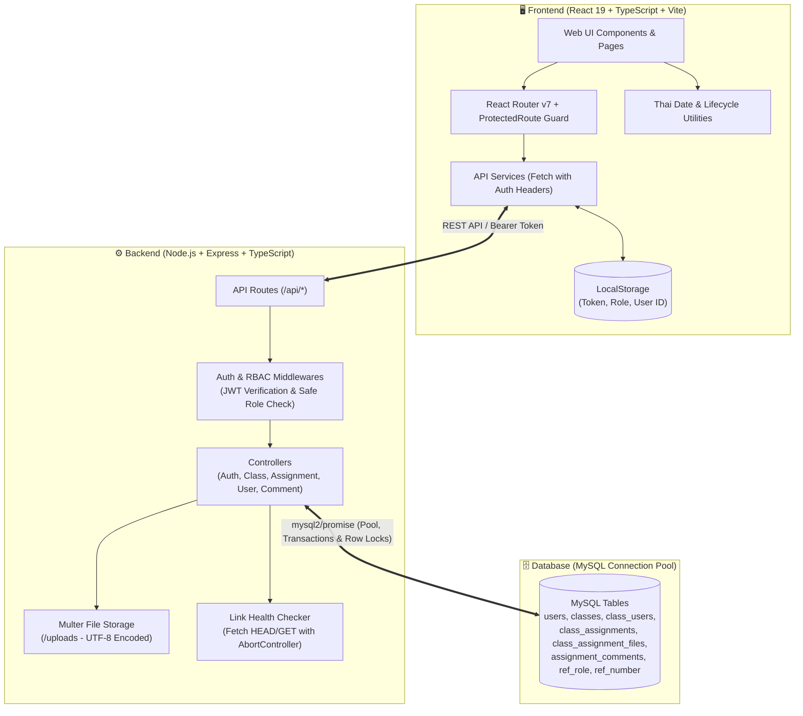

# 🎓 UP Classroom (PJ-Hub)
### ระบบศูนย์รวมรายวิชา คลังผลงาน และเอกสารการเรียนรู้แบบครบวงจร
*Full-Stack Academic Portfolio & Classroom Management Platform*

---

## 📖 ภาพรวมของระบบ (Project Overview)

**UP Classroom (PJ-Hub)** เป็นระบบเว็บแอปพลิเคชันแบบครบวงจร (Full-Stack Web Application) ที่พัฒนาขึ้นเพื่อสนับสนุนการเรียนการสอน การจัดเก็บและจัดแสดงผลงานนวัตกรรมของนิสิต เอกสารประกอบการเรียน รวมถึงการแลกเปลี่ยนข้อเสนอแนะระหว่างอาจารย์และนิสิตในรูปแบบสองทิศทาง (Interactive Two-Way Feedback)

ระบบถูกออกแบบโดยเน้นที่ความปลอดภัย ความถูกต้องของสิทธิ์การเข้าถึง และประสบการณ์การใช้งานที่ราบรื่น:
- **Role-Based Access Control (RBAC):** กำหนดและควบคุมสิทธิ์ 4 ระดับ (Admin, Teacher, Student, Guest) พร้อมกลไกความปลอดภัยป้องกันสิทธิ์รั่วไหล (Safe Role Evaluation)
- **Public & Guest-Friendly Access:** บุคคลภายนอกหรือผู้ใช้ที่ยังไม่ล็อกอินสามารถสืบค้นรายวิชาและดูข้อมูลเบื้องต้นของผลงานได้ โดยระบบจะซ่อนไฟล์แนบ ลิงก์ และความคิดเห็น พร้อมมีระบบแนะนำการเข้าสู่ระบบ
- **Permanent Storage & Quality Lifecycle:** ไฟล์แนบได้รับการการันตีจัดเก็บบนระบบอย่างถาวร พร้อมระบบติดตามรอบทบทวนคุณภาพผลงานประจำปี (365 วัน)
- **Link Health Verification:** ระบบตรวจสอบความพร้อมใช้งานของลิงก์ผลงานภายนอก (GitHub, Google Drive, Figma ฯลฯ) ป้องกันปัญหาลิงก์เสียหรือลิงก์ส่วนตัว
- **Thai Buddhist Era Support (พ.ศ.):** รองรับการแสดงผลและค้นหาด้วยปี พ.ศ. ไทยอย่างสมบูรณ์แบบ ทั้งในฝั่ง Frontend และ Backend

---

## 📑 สารบัญ (Table of Contents)

1. [✨ ฟีเจอร์หลักและความสามารถของระบบ (Key Features)](#-ฟีเจอร์หลักและความสามารถของระบบ-key-features)
2. [👥 ตารางสิทธิ์และการเข้าถึงตามบทบาท (Role & Permissions Matrix)](#-ตารางสิทธิ์และการเข้าถึงตามบทบาท-role--permissions-matrix)
3. [🏛️ สถาปัตยกรรมและการทำงานของระบบ (System Architecture & Flow)](#️-สถาปัตยกรรมและการทำงานของระบบ-system-architecture--flow)
4. [🛠️ เทคโนโลยีและเครื่องมือที่ใช้ (Tech Stack)](#️-เทคโนโลยีและเครื่องมือที่ใช้-tech-stack)
5. [📁 โครงสร้างโปรเจกต์ (Project Structure)](#-โครงสร้างโปรเจกต์-project-structure)
6. [⚙️ สิ่งที่ต้องเตรียมก่อนติดตั้ง (Prerequisites)](#️-สิ่งที่ต้องเตรียมก่อนติดตั้ง-prerequisites)
7. [🗄️ การติดตั้งฐานข้อมูล (Database Setup)](#️-การติดตั้งฐานข้อมูล-database-setup)
8. [🚀 ขั้นตอนการติดตั้งและรันระบบ (Step-by-Step Installation)](#-ขั้นตอนการติดตั้งและรันระบบ-step-by-step-installation)
   - [1. การติดตั้งและรัน Backend](#1-การติดตั้งและรัน-backend-nodejs--express--typescript)
   - [2. การติดตั้งและรัน Frontend](#2-การติดตั้งและรัน-frontend-react-19--vite)
   - [3. ตัวอย่างบัญชีผู้ใช้สำหรับทดสอบระบบ](#3-ตัวอย่างบัญชีผู้ใช้สำหรับทดสอบระบบ)
9. [🔌 เอกสารคู่มือ API (Backend API Reference)](#-เอกสารคู่มือ-api-backend-api-reference)
   - [1. Authentication Module (`/api/auth`)](#1--ระบบยืนยันตัวตน-authentication-module---apiauth)
   - [2. Class Module (`/api/class`)](#2--ระบบรายวิชา-class-module---apiclass)
   - [3. Class User Module (`/api/class-user`)](#3--ระบบสมาชิกในรายวิชา-class-user-module---apiclass-user)
   - [4. Assignment Module (`/api/assignment`)](#4--ระบบผลงานและไฟล์แนบ-assignment-module---apiassignment)
   - [5. Comment Module (`/api/comments`)](#5--ระบบความคิดเห็น-comment-module---apicomments)
   - [6. User Management Module (`/api/user`)](#6-️-ระบบจัดการผู้ใช้งาน-user-admin-module---apiuser)
10. [🛡️ มาตรการความปลอดภัยและความเสถียร (Security & Reliability)](#️-มาตรการความปลอดภัยและความเสถียร-security--reliability)
11. [❓ การแก้ไขปัญหาที่พบบ่อย (Troubleshooting & FAQs)](#-การแก้ไขปัญหาที่พบบ่อย-troubleshooting--faqs)

---

## ✨ ฟีเจอร์หลักและความสามารถของระบบ (Key Features)

### 🔐 1. ระบบยืนยันตัวตนและความปลอดภัย (Authentication & Account Management)
- **Local Authentication:** ลงทะเบียนและเข้าสู่ระบบด้วย Username/Email ร่วมกับรหัสผ่านที่เข้ารหัสความปลอดภัยด้วย **Bcrypt**
- **Single Sign-On (OAuth 2.0):** รองรับการล็อกอินผ่าน **Google OAuth** และ **Microsoft Graph API** พร้อมระบบผูกบัญชีอัตโนมัติ (Account Linking) ตามอีเมล
- **Interactive Social Demo Mode:** มีโหมดจำลองการล็อกอินผ่าน Google / Microsoft เพื่อความสะดวกรวดเร็วในการทดสอบระบบโดยไม่ต้องตั้งค่า Client Secret จริง
- **Auto-Generated Unique User ID:** ระบบออกรหัสผู้ใช้งานตามลำดับอัตโนมัติ (เช่น `US001`, `US002`) พร้อม Database Row Lock ป้องกัน Race Condition
- **Email Management:** รองรับการอัปเดตและเปลี่ยนแปลงอีเมลประจำตัวผู้ใช้งาน (`PUT /api/auth/email`)
- **Safe Session Handling:** จัดเก็บ JWT Token อย่างปลอดภัย พร้อมระบบล้างข้อมูลและ Redirect เมื่อ Token หมดอายุ

### 📚 2. ระบบจัดการรายวิชา (Classroom Management)
- **Course Catalog & Multi-Condition Search:** แคตตาล็อกรายวิชาพร้อมระบบ Real-time Debounce Search ค้นหาได้จากรหัสวิชา, ชื่อวิชา, คำอธิบาย, ชื่อผลงานในวิชา, ประเภทผลงาน, และปี พ.ศ.
- **Course CRUD:** สร้าง แก้ไข และลบข้อมูลรายวิชา (Soft Delete) เฉพาะอาจารย์เจ้าของวิชาและ Admin
- **Teacher Class Dashboard:** หน้ารวมรายวิชาที่อาจารย์แต่ละท่านเป็นผู้สร้างหรือรับผิดชอบ เพื่อความสะดวกในการติดตามงาน
- **Public Course Overview:** ผู้ใช้ทั่วไปและผู้ที่ยังไม่ล็อกอินสามารถเปิดดูภาพรวมและรายการผลงานในแต่ละรายวิชาได้

### 👥 3. ระบบสมาชิกและการลงทะเบียนรายวิชา (Class Members Management)
- **Member Enrollment:** อาจารย์ผู้สอนสามารถค้นหาและดึงผู้ใช้ที่ยังไม่ได้ลงทะเบียนเข้าสู่รายวิชาได้ทันที
- **Auto-Role Promotion:** เมื่อเพิ่มผู้ใช้ที่เป็น "ผู้ใช้ทั่วไป (Guest)" เข้าสู่รายวิชา ระบบสามารถปรับบทบาทให้เป็น "นิสิต (Student)" ให้อัตโนมัติ
- **Multi-Admin Auto Sync:** ผู้ดูแลระบบ (Admin) ทุกคนจะได้รับสิทธิ์เข้าถึงรายวิชาที่สร้างขึ้นใหม่โดยอัตโนมัติเพื่อความสะดวกในการกำกับดูแล

### 📂 4. ระบบคลังผลงานและเอกสารการเรียนรู้ (Assignments & Portfolio Hub)
- **Multi-File Upload with UTF-8 Thai Support:** อัปโหลดไฟล์แนบผลงานได้พร้อมกันหลายไฟล์ รองรับไฟล์ PDF, Word, รูปภาพ, สไลด์ ฯลฯ พร้อมระบบถอดรหัสชื่อไฟล์ภาษาไทยอย่างถูกต้อง ป้องกันปัญหาชื่อไฟล์ภาษาไทยเพี้ยน
- **Public vs Protected Assignment View:**
  - **โหมดสาธารณะ (Guest View):** ผู้ใช้ที่ยังไม่ล็อกอินสามารถเข้าดูข้อมูลพื้นฐาน (ชื่อผลงาน, คำอธิบาย, ชื่อผู้จัดทำ, ประเภท, ปี พ.ศ., ยอดเข้าชม) พร้อมป้ายแนะนำให้เข้าสู่ระบบ
  - **โหมดสมาชิก (Member View):** สมาชิกในรายวิชาและผู้ดูแลระบบสามารถดาวน์โหลดไฟล์แนบ เปิดลิงก์ภายนอก และร่วมแสดงความคิดเห็นได้
- **Smart Missing Resource Alert (`⚠️ ไม่มีไฟล์/ลิงค์`):**
  - มีป้ายแจ้งเตือนระบุผลงานที่ยังไม่มีไฟล์แนบและไม่มีลิงก์ภายนอก
  - **การจำกัดการมองเห็น:** ป้ายแจ้งเตือนนี้จะแสดงให้เห็น**เฉพาะอาจารย์ผู้รับผิดชอบรายวิชาหรือผู้ดูแลระบบ (Admin) เท่านั้น** นิสิตและผู้เข้าชมภายนอกจะไม่เห็นป้ายนี้
- **External Link Health Check:** ระบบทดสอบสถานะลิงก์ภายนอกแบบ Real-time รายงานสถานะความพร้อมใช้งาน (Healthy, 403 Forbidden, 404 Not Found, Timeout)
- **Permanent Storage & Retention Lifecycle:**
  - ไฟล์แนบผลงานจัดเก็บบนระบบ UP PJ-Hub อย่างถาวร
  - มีระบบคำนวณรอบทบทวนคุณภาพประจำปี (365 วัน / 1 ปีการศึกษา) แสดงสถานะและระยะเวลาที่เหลือในการทบทวน
- **View Count Analytics:** ระบบบันทึกยอดการเข้าชมผลงานแบบสะสม พร้อมฟอร์แมตตัวเลขแบบกระชับ (เช่น เข้าชม 5.2k ครั้ง)

### 💬 5. ระบบสนทนาและข้อเสนอแนะ (Collaborative Feedback & Comments)
- **Two-Way Feedback Loop:** นิสิตและอาจารย์สามารถแลกเปลี่ยนความคิดเห็น คำแนะนำ และข้อติชมในแต่ละผลงานได้
- **Comment Lifecycle & Ownership:** ผู้เขียนสามารถแก้ไขหรือลบความคิดเห็นของตนเองได้ โดยอาจารย์ผู้รับผิดชอบรายวิชาและ Admin มีสิทธิ์ร่วมดูแลความเรียบร้อย

### 🛡️ 6. ระบบผู้ดูแลระบบและจัดการสิทธิ์ (Admin User Management)
- **User Directory & Filter:** แสดงรายการผู้ใช้งานทั้งหมด พร้อมระบบค้นหา ตัวกรองบทบาท และสถานะบัญชี
- **Dynamic Role Switching:** ปรับเปลี่ยนบทบาทผู้ใช้ (Admin, Teacher, Student, Guest) ได้อย่างสะดวกรวดเร็ว
- **Account Activation Toggle:** สลับสถานะเปิดใช้งาน หรือระงับการใช้งานบัญชีผู้ใช้ได้ทันที
- **Self-Lockout Prevention:** กลไกป้องกันไม่ให้แอดมินเผลอเปลี่ยนสิทธิ์ตนเอง หรือระงับบัญชีตนเองจนล็อกตัวเองออกจากระบบ

---

## 👥 ตารางสิทธิ์และการเข้าถึงตามบทบาท (Role & Permissions Matrix)

ระบบแบ่งผู้ใช้ออกเป็น 4 ระดับบทบาทอย่างชัดเจน เพื่อความปลอดภัยและความเป็นระเบียบของข้อมูล:

| ความสามารถของระบบ (Feature / Action) | Admin <br> `(Role 0)` | Teacher <br> `(Role 1)` | Student <br> `(Role 2)` | Guest <br> `(Role 3)` | ไม่ได้ล็อกอิน <br> `(Public)` |
| :--- | :---: | :---: | :---: | :---: | :---: |
| 🔍 ดูและค้นหาแคตตาล็อกรายวิชา | ✅ | ✅ | ✅ | ✅ | ✅ |
| 📖 ดูภาพรวมรายวิชาและรายการผลงาน | ✅ | ✅ | ✅ | ✅ | ✅ |
| 👁️ ดูข้อมูลเบื้องต้นของผลงาน (ชื่อ/คำอธิบาย/ผู้จัดทำ) | ✅ | ✅ | ✅ | ✅ | ✅ |
| 📥 เข้าถึงและดาวน์โหลดไฟล์แนบผลงาน | ✅ | ✅ (เฉพาะวิชาของตน) | ✅ (เฉพาะวิชาที่ลงเรียน) | ❌ | ❌ |
| 🔗 เข้าถึงลิงก์ผลงานภายนอก (GitHub/Figma ฯลฯ) | ✅ | ✅ (เฉพาะวิชาของตน) | ✅ (เฉพาะวิชาที่ลงเรียน) | ❌ | ❌ |
| ⚠️ เห็นป้ายแจ้งเตือน `ไม่มีไฟล์/ลิงค์` ในวิชา | ✅ | ✅ (เฉพาะวิชาของตน) | ❌ | ❌ | ❌ |
| ➕ สร้างรายวิชาใหม่ (Create Class) | ✅ | ✅ | ❌ | ❌ | ❌ |
| ✏️ แก้ไข / ลบรายวิชา | ✅ (ทุกวิชา) | ✅ (เฉพาะวิชาของตน) | ❌ | ❌ | ❌ |
| 👥 เพิ่ม / ลบ สมาชิกในรายวิชา | ✅ | ✅ (เฉพาะวิชาของตน) | ❌ | ❌ | ❌ |
| 📤 ส่งผลงาน / อัปโหลดไฟล์ในรายวิชา | ✅ | ✅ | ✅ (เฉพาะวิชาที่ลงเรียน) | ❌ | ❌ |
| 📝 แก้ไข / ลบ ผลงาน | ✅ (ทุกผลงาน) | ✅ (เฉพาะผลงานในวิชาตน) | ✅ (เฉพาะผลงานของตน) | ❌ | ❌ |
| 💬 แสดงความคิดเห็นในผลงาน | ✅ | ✅ (เฉพาะผลงานในวิชาตน) | ✅ (เฉพาะวิชาที่ลงเรียน) | ❌ | ❌ |
| 🔍 ตรวจสอบสุขภาพลิงก์ (Link Health Check) | ✅ | ✅ | ✅ | ❌ | ❌ |
| ⚙️ ปรับระดับสิทธิ์ผู้ใช้ (Change Role) | ✅ (เปลี่ยนได้ทุก Role) | ✅ (ปรับเป็น Student/Guest) | ❌ | ❌ | ❌ |
| 🚫 ระงับ / เปิดการใช้งานบัญชี (Ban/Active) | ✅ | ❌ | ❌ | ❌ | ❌ |

---

## 🏛️ สถาปัตยกรรมและการทำงานของระบบ (System Architecture & Flow)

ระบบทำงานบนสถาปัตยกรรมแบบ Client-Server แยกฝั่ง Frontend และ Backend อย่างชัดเจน และสื่อสารกันผ่าน RESTful JSON API:


```mermaid
flowchart TD
    subgraph Client ["🖥️ Frontend (React 19 + TypeScript + Vite)"]
        UI["Web UI Components & Pages"]
        Router["React Router v7 + ProtectedRoute Guard"]
        Service["API Services (Fetch with Auth Headers)"]
        DateUtils["Thai Date & Lifecycle Utilities"]
        Storage[("LocalStorage\n(Token, Role, User ID)")]
        
        UI --> Router
        Router --> Service
        Service <--> Storage
        UI --> DateUtils
    end

    subgraph Server ["⚙️ Backend (Node.js + Express + TypeScript)"]
        APIRouter["API Routes (/api/*)"]
        AuthMiddleware["Auth & RBAC Middlewares\n(JWT Verification & Safe Role Check)"]
        Controllers["Controllers\n(Auth, Class, Assignment, User, Comment)"]
        MulterStorage["Multer File Storage\n(/uploads - UTF-8 Encoded)"]
        LinkChecker["Link Health Checker\n(Fetch HEAD/GET with AbortController)"]
        
        APIRouter --> AuthMiddleware
        AuthMiddleware --> Controllers
        Controllers --> MulterStorage
        Controllers --> LinkChecker
    end

    subgraph Database ["🗄️ Database (MySQL Connection Pool)"]
        Tables[("MySQL Tables\nusers, classes, class_users,\nclass_assignments, class_assignment_files,\nassignment_comments, ref_role, ref_number")]
    end

    Service <== "REST API / Bearer Token" ==> APIRouter
    Controllers <== "mysql2/promise (Pool, Transactions & Row Locks)" ==> Tables
```

### แผนผังโครงสร้างฐานข้อมูล (Database Schema Overview)

- **`users`** : เก็บข้อมูลผู้ใช้งาน รหัสผู้ใช้ อีเมล รหัสผ่าน (Bcrypt Hashed) บทบาท (`role_flg`) บัญชี Social OAuth และสถานะการใช้งาน (`deleted_flg`)
- **`ref_role`** : ตารางอ้างอิงชื่อบทบาท (`0`: ผู้ดูแลระบบ, `1`: อาจารย์, `2`: นิสิต, `3`: ผู้ใช้ทั่วไป)
- **`classes`** : จัดเก็บข้อมูลรายวิชา รหัสวิชา ชื่อวิชา รายละเอียด ผู้สร้างวิชา และวันที่สร้าง
- **`class_users`** : จัดเก็บความสัมพันธ์การเป็นสมาชิกในรายวิชาของแต่ละผู้ใช้ พร้อมสถานะบทบาท
- **`class_assignments`** : จัดเก็บข้อมูลผลงาน ชื่องาน รายละเอียด ลิงก์ภายนอก ประเภทงาน ยอดเข้าชม (`view_cnt`) และผู้ส่ง
- **`class_assignment_files`** : จัดเก็บชื่อไฟล์ ขนาด ประเภท และ Path ของไฟล์แนบในแต่ละผลงาน
- **`assignment_comments`** : จัดเก็บความคิดเห็น ข้อเสนอแนะ และการแลกเปลี่ยนระหว่างผู้ใช้
- **`ref_number`** : จัดเก็บเลขรันอัตโนมัติสำหรับ User Code (`US001`, `US002`...) ป้องกันรหัสซ้ำ

---

## 🛠️ เทคโนโลยีและเครื่องมือที่ใช้ (Tech Stack)

### **Frontend**
- **Core Framework:** [React 19.2](https://react.dev/) + [TypeScript 5.9](https://www.typescriptlang.org/)
- **Build Tool / Bundler:** [Vite 7.2](https://vitejs.dev/)
- **Routing Engine:** [React Router v7](https://reactrouter.com/)
- **Iconography:** [React Icons](https://react-icons.github.io/react-icons/) (Feather Icons Pack)
- **Notifications:** [React Toastify](https://fkhadra.github.io/react-toastify/)
- **Styling Architecture:** Modern Vanilla CSS Design System (CSS Custom Properties, Glassmorphism, Responsive Grid & Flexbox, Smooth Micro-animations)

### **Backend**
- **Runtime Environment:** [Node.js](https://nodejs.org/)
- **Web Framework:** [Express 5.2](https://expressjs.com/)
- **Language & Compiler:** [TypeScript](https://www.typescriptlang.org/) (รันผ่าน `ts-node-dev`)
- **Database Driver:** [mysql2/promise](https://github.com/sidorares/node-mysql2) (Connection Pooling, Prepared Statements, Database Transactions)
- **Authentication & Encryption:** [JSON Web Token (JWT)](https://jwt.io/) + [Bcrypt.js](https://github.com/dcodeIO/bcrypt.js)
- **Multipart Form & File Upload:** [Multer](https://github.com/expressjs/multer) พร้อม Custom Buffer Decoding สำหรับชื่อไฟล์ภาษาไทย
- **Security & Config:** [CORS](https://github.com/expressjs/cors), [Dotenv](https://github.com/motdotla/dotenv)
- **Network & Verification:** Fetch API with `AbortController` สำหรับระบบตรวจสอบสถานะลิงก์ภายนอก

---

## 📁 โครงสร้างโปรเจกต์ (Project Structure)

```text
PJ-Hub/
├── PJHub_Data.zip                   # 📦 ไฟล์สำรองฐานข้อมูลพร้อมข้อมูลเริ่มต้น (Database Backup)
├── README.md                        # 📖 คู่มือการติดตั้งและเอกสารอธิบายระบบฉบับสมบูรณ์
│
├── backend/                         # ⚙️ โค้ดส่วน Backend API (Node.js + Express + TypeScript)
│   ├── .env                         # ไฟล์ตัวแปรสภาพแวดล้อม (Database, JWT Secret, Port)
│   ├── .env.example                 # ตัวอย่างการตั้งค่าตัวแปรสภาพแวดล้อม
│   ├── package.json                 # Dependencies และคำสั่งรันของ Backend
│   ├── tsconfig.json                # TypeScript Configuration
│   ├── uploads/                     # โฟลเดอร์จัดเก็บไฟล์แนบผลงานที่อัปโหลดเข้าสู่ระบบ
│   └── src/
│       ├── index.ts                 # จุดเริ่มต้นของ Server และการเชื่อมต่อ Middleware/Routes
│       ├── db.ts                    # Connection Pool และ Schema Initializer ของ MySQL
│       ├── controllers/             # คอนโทรลเลอร์ควบคุม Business Logic
│       │   ├── auth.controller.ts       # Login, Register, OAuth, Profile, Update Email
│       │   ├── class.controller.ts      # CRUD รายวิชา, ค้นหารายวิชา, ดึงรายละเอียดวิชา
│       │   ├── classUser.controller.ts  # จัดการสมาชิกในรายวิชา และการดึงรายชื่อ
│       │   ├── assignment.controller.ts # ผลงาน, ไฟล์แนบ, ยอดเข้าชม, ค้นหา, ตรวจสอบลิงก์
│       │   ├── comment.controller.ts    # เพิ่ม/แก้ไข/ลบ ความคิดเห็นในผลงาน
│       │   └── user.controller.ts       # ปรับระดับสิทธิ์ (Role) และระงับ/เปิดบัญชีผู้ใช้
│       ├── middlewares/             # มิดเดิลแวร์สำหรับตรวจสอบสิทธิ์และการอัปโหลด
│       │   ├── auth.middlewares.ts      # ตรวจสอบ JWT Bearer Token และดึงข้อมูลผู้ใช้
│       │   └── upload.middlewares.ts    # Multer Configuration รองรับ UTF-8 ภาษาไทย
│       ├── routes/                  # เส้นทาง API Endpoints ทั้งหมด
│       │   ├── auth.routes.ts           # /api/auth
│       │   ├── class.routes.ts          # /api/class
│       │   ├── classUser.routes.ts      # /api/class-user
│       │   ├── assignment.routes.ts     # /api/assignment
│       │   ├── comment.routes.ts        # /api/comments
│       │   └── user.routes.ts           # /api/user
│       └── types/                   # Type Declarations (ขยาย Express Request Type)
│
└── frontend/                        # 🖥️ โค้ดส่วน Frontend Web App (React 19 + TypeScript + Vite)
    ├── index.html                   # หน้า HTML หลักของ Single Page Application
    ├── package.json                 # Dependencies และคำสั่งรันของ Frontend
    ├── tsconfig.json                # TypeScript Configuration
    ├── vite.config.ts               # การตั้งค่า Vite Build Tool
    └── src/
        ├── App.tsx                  # จุดรวม Routing และ Route Guards (<ProtectedRoute>)
        ├── main.tsx                 # Entry Point ของ React Application
        ├── components/              # คอมโพเนนต์ที่ใช้ร่วมกัน
        │   └── ProtectedRoute.tsx       # คอมโพเนนต์กรองสิทธิ์ตาม Role และสถานะการล็อกอิน
        ├── layouts/                 # โครงร่างหน้าจอหลัก
        │   └── MainLayout.tsx           # Layout หลักพร้อม Sidebar, User Header, Navigation
        ├── pages/                   # หน้าจอแสดงผลทั้งหมดของระบบ
        │   ├── Home.tsx                 # หน้าแรก: ค้นหาแบบรวม รายวิชา ผลงาน พร้อมแท็บกรอง
        │   ├── Login.tsx                # เข้าสู่ระบบ (รองรับ Local, Social Demo, OAuth)
        │   ├── Register.tsx             # สมัครสมาชิกใหม่
        │   ├── UserManagement.tsx       # จัดการผู้ใช้และสิทธิ์ (เฉพาะ Admin)
        │   ├── class/                   # หน้าจอเกี่ยวกับรายวิชา
        │   │   ├── CreateClass.tsx          # สร้างรายวิชาใหม่
        │   │   ├── ClassDetail.tsx          # รายละเอียดวิชา รายการผลงาน และตัวกรองสิทธิ์
        │   │   ├── ClassEdit.tsx            # แก้ไขข้อมูลรายวิชา
        │   │   ├── ClassUserManagement.tsx  # จัดการสมาชิกในรายวิชา
        │   │   └── TeacherClassManagement.tsx # รายวิชาที่อาจารย์รับผิดชอบ
        │   └── assignment/              # หน้าจอเกี่ยวกับผลงาน
        │       ├── CreateAssignment.tsx     # ส่งผลงานใหม่ พร้อมอัปโหลดไฟล์และตรวจลิงก์
        │       ├── AssignmentDetail.tsx     # รายละเอียดผลงาน ไฟล์แนบ ความคิดเห็น สถิติ
        │       ├── AssignmentManagement.tsx # หน้ารายการผลงานของตนเอง และรอบการทบทวน
        │       └── AssignmentEdit.tsx       # แก้ไขข้อมูลผลงาน จัดการไฟล์แนบ
        ├── services/                # ฟังก์ชันเชื่อมต่อ REST API ฝั่ง Backend
        │   ├── auth.service.ts          # Authentication Services
        │   ├── class.service.ts         # Classroom Services
        │   ├── classUser.service.ts     # Member Enrollment Services
        │   ├── assignment.service.ts    # Assignment, Search & Link Check Services
        │   ├── comment.service.ts       # Comment Services
        │   └── user.service.ts          # User Management Services
        ├── utils/                   # ฟังก์ชันช่วยเหลือและคำนวณ
        │   └── dateUtils.ts             # แปลงวันที่ ปี พ.ศ. ไทย และคำนวณรอบทบทวนคุณภาพ
        └── css/                     # สไตล์ชีต Vanilla CSS ทั้งหมดของระบบ
```

---

## ⚙️ สิ่งที่ต้องเตรียมก่อนติดตั้ง (Prerequisites)

เพื่อให้ระบบสามารถติดตั้งและทำงานได้อย่างสมบูรณ์ กรุณาตรวจสอบซอฟต์แวร์ในเครื่องของคุณ:

1. **Node.js:** แนะนำเวอร์ชัน **`v18.x`** หรือ **`v20.x LTS`** ขึ้นไป ([ดาวน์โหลด Node.js](https://nodejs.org/))
2. **Package Manager:** **npm** (ติดตั้งมาพร้อมกับ Node.js) หรือ pnpm / yarn
3. **Database Server:** **MySQL Server 8.0+** หรือโปรแกรมจำลอง Web Server เช่น:
   - [XAMPP](https://www.apachefriends.org/) (แนะนำสำหรับการรัน Local Development)
   - [WampServer](https://www.wampserver.com/)
   - [MySQL Workbench](https://www.mysql.com/products/workbench/)
4. **Web Browser:** Google Chrome, Microsoft Edge, Firefox หรือ Safari เวอร์ชันปัจจุบัน

---

## 🗄️ การติดตั้งฐานข้อมูล (Database Setup)

1. **เปิดบริการ MySQL Server:**
   - หากใช้ **XAMPP**: เปิดโปรแกรม `XAMPP Control Panel` แล้วกดปุ่ม **Start** ที่โมดูล **MySQL** และ **Apache**
2. **สร้างฐานข้อมูลใหม่:**
   - เปิดเว็บเบราว์เซอร์ไปที่ `http://localhost/phpmyadmin` (หรือใช้ MySQL Workbench)
   - ไปที่แท็บ **Databases** (ฐานข้อมูล) และสร้างฐานข้อมูลชื่อ:
     ```sql
     CREATE DATABASE classroom CHARACTER SET utf8mb4 COLLATE utf8mb4_unicode_ci;
     ```
3. **นำเข้าข้อมูล (Import Database):**
   - แตกไฟล์ **`PJHub_Data.zip`** ที่อยู่ในโฟลเดอร์หลักของโปรเจกต์ จะได้รับไฟล์ `.sql`
   - ใน phpMyAdmin เลือกฐานข้อมูล `classroom` ที่เพิ่งสร้าง
   - ไปที่แท็บ **Import (นำเข้า)** -> เลือกไฟล์ `.sql` ที่แตกออกมา -> กดปุ่ม **Import (ดำเนินการ)**

---

## 🚀 ขั้นตอนการติดตั้งและรันระบบ (Step-by-Step Installation)

### 1. การติดตั้งและรัน Backend (Node.js + Express + TypeScript)

1. เปิด Terminal / PowerShell แล้วเข้าไปที่โฟลเดอร์ `backend`:
   ```bash
   cd backend
   ```

2. ติดตั้ง Dependencies ทั้งหมด:
   ```bash
   npm install
   ```

3. ตรวจสอบหรือสร้างไฟล์ `.env` ในโฟลเดอร์ `backend/` (คัดลอกได้จาก `.env.example`):
   ```env
   # พอร์ตสำหรับรัน Backend API Server
   PORT=3000

   # การตั้งค่าเชื่อมต่อ MySQL Database
   DB_HOST=localhost
   DB_USER=root
   DB_PASSWORD=
   DB_NAME=classroom

   # คีย์สำหรับถอดรหัสและเข้ารหัส JWT Token (เปลี่ยนเป็นสตริงที่ปลอดภัย)
   JWT_SECRET=classroom_super_secret_jwt_key_2026

   # URL ของระบบ (ใช้สำหรับระบบ Callback และ CORS)
   FRONTEND_URL=http://localhost:5173
   BACKEND_URL=http://localhost:3000

   # (ไม่บังคับ) การตั้งค่า Google / Microsoft OAuth (หากต้องการเปิดใช้จริง)
   # GOOGLE_CLIENT_ID=your_google_client_id
   # GOOGLE_CLIENT_SECRET=your_google_client_secret
   # MICROSOFT_CLIENT_ID=your_microsoft_client_id
   # MICROSOFT_CLIENT_SECRET=your_microsoft_client_secret
   ```

4. เริ่มรัน Backend Development Server:
   ```bash
   npm run dev
   ```
   > 🟢 หากสำเร็จ จะขึ้นข้อความ: `Server is running on http://localhost:3000`

---

### 2. การติดตั้งและรัน Frontend (React 19 + Vite)

1. เปิด Terminal / PowerShell อีกหน้าต่างหนึ่ง แล้วเข้าไปที่โฟลเดอร์ `frontend`:
   ```bash
   cd frontend
   ```

2. ติดตั้ง Dependencies:
   ```bash
   npm install
   ```

3. เริ่มรัน Frontend Development Server:
   ```bash
   npm run dev
   ```

4. เปิดเว็บบราวเซอร์และเข้าใช้งานได้ที่:
   ```text
   http://localhost:5173
   ```

---

### 3. ตัวอย่างบัญชีผู้ใช้สำหรับทดสอบระบบ

ระบบมีบัญชีผู้ใช้เริ่มต้นหลากหลายบทบาท ให้คุณทดสอบการทำงานได้ทันที (หรือสามารถลงทะเบียนบัญชีใหม่ผ่านหน้าเว็บได้):

| บทบาท (Role) | รหัส Role | Username / Identifier | รหัสผ่าน (Password) | วัตถุประสงค์ในการทดสอบ |
| :--- | :---: | :--- | :--- | :--- |
| **Admin (ผู้ดูแลระบบ)** | `0` | `admin` | `1234` | จัดการผู้ใช้ทั้งหมด, ดูแลทุกรายวิชาและผลงาน, เห็นแจ้งเตือนผลงานที่ไม่มีไฟล์ |
| **Teacher (อาจารย์)** | `1` | `teacher` | `1234` | สร้างรายวิชา, ดึงนิสิตเข้าวิชา, ตรวจผลงาน, เห็นแจ้งเตือนผลงานในวิชาตน |
| **Student (นิสิต)** | `2` | `student` | `1234` | ดูวิชาที่ลงเรียน, ส่งผลงาน, อัปโหลดไฟล์, คอมเมนต์ |
| **Guest (ผู้ใช้ทั่วไป)** | `3` | `guest` | `1234` | ค้นหารายวิชาสาธารณะ (สิทธิ์เริ่มต้นหลังสมัครใหม่) |

> 💡 **เคล็ดลับสำหรับการทดสอบ Social Login:** ในหน้า Login สามารถคลิกปุ่ม **Google** หรือ **Microsoft** และเลือก **"ทดสอบด้วยโหมด Demo"** เพื่อล็อกอินด้วยข้อมูลจำลองได้ทันทีโดยไม่ต้องตั้งค่า OAuth Client ID จริง

---

## 🔌 เอกสารคู่มือ API (Backend API Reference)

API ทั้งหมดจะขึ้นต้นด้วย Base URL: `http://localhost:3000/api`

### 1. 🔐 ระบบยืนยันตัวตน (Authentication Module - `/api/auth`)

| Method | Endpoint | สิทธิ์ที่ต้องการ | คำอธิบาย |
| :--- | :--- | :--- | :--- |
| `POST` | `/api/auth/register` | สาธารณะ | สมัครสมาชิกใหม่ (ส่ง `username`, `email`, `password`) |
| `POST` | `/api/auth/login` | สาธารณะ | เข้าสู่ระบบด้วย username/email และ password รับ Token |
| `GET` | `/api/auth/profile` | Bearer Token | ดึงข้อมูลโปรไฟล์ของผู้ใช้ปัจจุบันจาก Token |
| `PUT` | `/api/auth/email` | Bearer Token | อัปเดตอีเมลของผู้ใช้งานปัจจุบัน |
| `GET` | `/api/auth/oauth/google` | สาธารณะ | ดึง URL สำหรับล็อกอินผ่าน Google OAuth |
| `GET` | `/api/auth/google/callback`| สาธารณะ | Callback รับ Auth Code จาก Google และสร้าง Session |
| `GET` | `/api/auth/microsoft/url` | สาธารณะ | ดึง URL สำหรับล็อกอินผ่าน Microsoft OAuth |
| `GET` | `/api/auth/microsoft/callback`| สาธารณะ | Callback รับ Auth Code จาก Microsoft |
| `POST` | `/api/auth/demo-social-login` | สาธารณะ | จำลองการล็อกอินผ่าน Social Account สำหรับทดสอบ |

---

### 2. 📚 ระบบรายวิชา (Class Module - `/api/class`)

| Method | Endpoint | สิทธิ์ที่ต้องการ | คำอธิบาย |
| :--- | :--- | :--- | :--- |
| `GET` | `/api/class/view` | สาธารณะ | ดึงรายการรายวิชาทั้งหมด (รองรับ `?search=...` ค้นหาทั้งชื่อ รหัสวิชา ประเภทผลงาน และปี พ.ศ.) |
| `GET` | `/api/class/getclass/:classId` | สาธารณะ (รองรับ Token) | ดึงข้อมูลรายละเอียดของรายวิชา พร้อมคำนวณสิทธิ์ `is_responsible` และ `is_enrolled` |
| `GET` | `/api/class/getclass/by-user` | Bearer Token | ดึงรายวิชาที่ผู้ใช้ปัจจุบันลงทะเบียนเรียนอยู่ |
| `GET` | `/api/class/getclass/by-teacher` | Admin (0), Teacher (1) | ดึงรายวิชาที่อาจารย์คนปัจจุบันเป็นผู้สร้างหรือรับผิดชอบ |
| `POST` | `/api/class/create` | Admin (0), Teacher (1) | สร้างรายวิชาใหม่ (`classId`, `className`, `describe`) |
| `PUT` | `/api/class/update/:classId` | อาจารย์ผู้สร้างวิชา / Admin | แก้ไขข้อมูลรายวิชา |
| `DELETE`| `/api/class/delete/:classId` | อาจารย์ผู้สร้างวิชา / Admin | ลบรายวิชา (Soft Delete) |

---

### 3. 👥 ระบบสมาชิกในรายวิชา (Class User Module - `/api/class-user`)

| Method | Endpoint | สิทธิ์ที่ต้องการ | คำอธิบาย |
| :--- | :--- | :--- | :--- |
| `GET` | `/api/class-user/classes` | Admin (0), Teacher (1) | ดึงรายชื่อวิชาที่ตนเองดูแลสำหรับจัดการสมาชิก |
| `GET` | `/api/class-user/:classId/users` | Admin (0), Teacher (1) | ดึงรายชื่อสมาชิกทั้งหมดในรายวิชาที่ระบุ |
| `POST` | `/api/class-user/:classId/users` | อาจารย์ผู้สร้างวิชา / Admin | เพิ่มสมาชิกเข้าสู่รายวิชา (พร้อมตัวเลือกปรับ Role) |
| `DELETE`| `/api/class-user/:classId/users/:userId` | อาจารย์ผู้สร้างวิชา / Admin | ลบสมาชิกออกจากรายวิชา |

---

### 4. 📂 ระบบผลงานและไฟล์แนบ (Assignment Module - `/api/assignment`)

| Method | Endpoint | สิทธิ์ที่ต้องการ | คำอธิบาย |
| :--- | :--- | :--- | :--- |
| `GET` | `/api/assignment/search` | สาธารณะ | ค้นหาผลงานแบบสาธารณะตามคีย์เวิร์ด ชื่อ ชนิดวิชา หรือปี พ.ศ. (`?search=...`) |
| `GET` | `/api/assignment/get-assignment/:classId` | สาธารณะ | ดึงรายการผลงานทั้งหมดในรายวิชาที่ระบุ พร้อมแฟล็ก `has_no_resources` |
| `GET` | `/api/assignment/public-detail/:assignment_id` | สาธารณะ | ดึงข้อมูลเบื้องต้นของผลงานสำหรับผู้ที่ยังไม่ได้ Login (ซ่อนไฟล์/ลิงก์) |
| `GET` | `/api/assignment/get-detail/:assignment_id` | Bearer Token | ดึงรายละเอียดผลงานแบบเต็ม รายการไฟล์แนบ ลิงก์ และสิทธิ์การจัดการ |
| `GET` | `/api/assignment/get-assignment-by-user` | นิสิต / อาจารย์ / Admin | ดึงรายการผลงานของตนเอง หรือทั้งหมดในระบบ (รองรับ `?only_me=true`) |
| `GET` | `/api/assignment/file/:fileId` | สมาชิกในวิชา / Admin | สตรีมและดาวน์โหลดไฟล์แนบของผลงานแบบปลอดภัย |
| `POST` | `/api/assignment/create` | นิสิตในวิชา / อาจารย์ / Admin | สร้างผลงานใหม่พร้อมอัปโหลดไฟล์แนบ (`multipart/form-data`) สูงสุด 10 ไฟล์ |
| `PUT` | `/api/assignment/update/:assignmentId` | เจ้าของผลงาน / ผู้สอน / Admin | แก้ไขข้อมูลผลงาน เพิ่มไฟล์ใหม่ หรือระบุไฟล์ที่ต้องการลบ |
| `DELETE`| `/api/assignment/delete/:assignmentId` | เจ้าของผลงาน / ผู้สอน / Admin | ลบผลงาน (Soft Delete) |
| `POST` | `/api/assignment/check-link` | Bearer Token | ตรวจสอบสถานะการเชื่อมต่อและความพร้อมใช้งานของ External Link |

---

### 5. 💬 ระบบความคิดเห็น (Comment Module - `/api/comments`)

| Method | Endpoint | สิทธิ์ที่ต้องการ | คำอธิบาย |
| :--- | :--- | :--- | :--- |
| `GET` | `/api/comments/:assignment_id` | สมาชิกในวิชา / Admin | ดึงรายการความคิดเห็นทั้งหมดของผลงาน |
| `POST` | `/api/comments/create` | เจ้าของผลงาน / ผู้สอน / Admin | เพิ่มความคิดเห็นใหม่ (`assignment_id`, `comment_text`) |
| `PUT` | `/api/comments/update/:comment_id` | เจ้าของความคิดเห็น | แก้ไขข้อความความคิดเห็นของตนเอง |
| `DELETE`| `/api/comments/delete/:comment_id` | เจ้าของความเห็น / ผู้สอน / Admin | ลบความคิดเห็น |

---

### 6. 🛡️ ระบบจัดการผู้ใช้งาน (User Admin Module - `/api/user`)

| Method | Endpoint | สิทธิ์ที่ต้องการ | คำอธิบาย |
| :--- | :--- | :--- | :--- |
| `GET` | `/api/user/getUsers` | Admin (0), Teacher (1) | ดึงรายชื่อผู้ใช้ทั้งหมดในระบบ |
| `GET` | `/api/user/get-role` | Admin (0), Teacher (1) | ดึงรายการประเภทบทบาททั้งหมด (`ref_role`) |
| `GET` | `/api/user/users/:classId/available-users` | อาจารย์ผู้สร้างวิชา / Admin | ดึงรายชื่อผู้ใช้ที่ยังไม่ได้อยู่ในรายวิชานั้น |
| `PATCH`| `/api/user/users/:user_id/role` | Admin (0), Teacher (1) | ปรับเปลี่ยนระดับสิทธิ์ (Role) ของผู้ใช้ |
| `PATCH`| `/api/user/users/:user_id/active` | Admin (0) | สลับสถานะเปิดใช้งาน / ระงับการใช้งานบัญชี |

---

## 🛡️ มาตรการความปลอดภัยและความเสถียร (Security & Reliability)

1. **Safe Role Evaluation & Guest Protection:**
   - ตรวจสอบ `token` ควบคู่กับระดับสิทธิ์อย่างรัดกุม ป้องกันไม่ให้การแปลงค่าว่างหรือ `null` จาก `localStorage` ถูกประเมินเป็น `0` (Admin) ช่วยให้ผู้ใช้ที่เป็น Guest ไม่สามารถมองเห็นปุ่มจัดการหรือป้ายแจ้งเตือนพิเศษได้
2. **Restricted Missing Resource Notifications:**
   - ป้ายแจ้งเตือน `⚠️ ไม่มีไฟล์/ลิงค์` ในหน้ารายวิชาถูกจำกัดการมองเห็นไว้ให้**เฉพาะอาจารย์ผู้รับผิดชอบรายวิชาหรือผู้ดูแลระบบ**เท่านั้น เพื่อความเป็นส่วนตัวและความเรียบร้อยในการจัดแสดงผลงาน
3. **Defense in Depth & Two-Layer Route Guards:**
   - **Frontend Layer:** ใช้คอมโพเนนต์ `<ProtectedRoute allowedRoles={[...]}>` ตรวจสอบ Token และสิทธิ์ของผู้ใช้ก่อนเรนเดอร์หน้าจอ
   - **Backend Layer:** มี `authMiddleware` และ `authorizeRoles(...)` ตรวจสอบ Signature ของ JWT Token ในทุก Endpoint พร้อมเช็คความเป็นเจ้าของข้อมูล (Data Ownership Validation) ซ้ำใน Controller เสมอ
4. **Data Sanitization on Public Endpoints:**
   - Endpoint สาธารณะ เช่น `getAssignmentPublicDetail` จะตัดข้อมูลไฟล์แนบ ลิงก์ และคอมเมนต์ออกทางฝั่งเซิร์ฟเวอร์ เพื่อป้องกันไม่ให้ข้อมูลสำคัญรั่วไหลไปยังบุคคลภายนอกที่ยังไม่ได้เข้าสู่ระบบ
5. **Database Concurrency & Transaction Safety:**
   - ใช้ Database Transaction (`BEGIN ... COMMIT / ROLLBACK`) ในการบันทึกข้อมูลที่มีหลายตารางเกี่ยวเนื่องกัน
   - ใช้ Row Locking (`SELECT ... FOR UPDATE`) ในตาราง `ref_number` ป้องกันปัญหาการสร้างรหัสผู้ใช้ (`US001`) ซ้ำกันในกรณีที่มีการสมัครพร้อมกันหลายคน
6. **Network Timeouts & Fail-Safe Link Checking:**
   - ใช้ `AbortController` กำหนด Timeout (6 วินาที) สำหรับระบบตรวจเช็คสุขภาพของลิงก์ภายนอก เพื่อป้องกันไม่ให้คำร้องขอค้างและลดภาระของเซิร์ฟเวอร์
7. **Prevention of Self-Lockout (ป้องกันการล็อกตนเอง):**
   - ผู้ดูแลระบบ (Admin) ไม่สามารถเปลี่ยนบทบาทของตัวเอง หรือระงับบัญชีของตัวเองได้ ป้องกันอุบัติเหตุที่ทำให้ไม่มีผู้ดูแลระบบในระบบ
8. **Safe File Uploads & UTF-8 Encoding:**
   - ใช้ Multer จัดการจัดเก็บไฟล์แนบในโฟลเดอร์แยก สุ่มชื่อไฟล์เพื่อป้องกันการบันทึกทับ (Collision) และถอดรหัสชื่อไฟล์ต้นฉบับเป็น UTF-8 เพื่อรองรับภาษาไทยอย่างสมบูรณ์

---

## ❓ การแก้ไขปัญหาที่พบบ่อย (Troubleshooting & FAQs)

### 1. ล็อกอินไม่ผ่าน หรือขึ้น "database error"
- ตรวจสอบว่าบริการ **MySQL** ใน XAMPP หรือ MySQL Server กำลังทำงานอยู่ (Port 3306)
- ตรวจสอบการตั้งค่า `DB_USER` และ `DB_PASSWORD` ในไฟล์ `backend/.env` ว่าตรงกับการตั้งค่า MySQL ในเครื่องของคุณหรือไม่
- ตรวจสอบว่าได้นำเข้าไฟล์ฐานข้อมูล `PJHub_Data.zip` (`.sql`) เข้าไปยังฐานข้อมูล `classroom` แล้วหรือยัง

### 2. ชื่อไฟล์ภาษาไทยแสดงผลเป็นเครื่องหมายคำถามหรืออ่านไม่ออก
- ระบบได้เพิ่มการแปลง Header RFC 5987 / UTF-8 decoding ในฟังก์ชันดาวน์โหลดไฟล์แล้ว หากพบปัญหาในไฟล์เดิมที่เคยอัปโหลด ให้ทดลองอัปโหลดไฟล์ใหม่ผ่านหน้าเว็บ

### 3. ผู้ใช้ Guest มองเห็นปุ่มลบหรือป้ายแจ้งเตือน
- ให้ทดลองกด `Ctrl + F5` หรือเคลียร์แคชเบราว์เซอร์ เพื่อให้ Frontend โหลดสคริปต์เวอร์ชันล่าสุดที่มีการปรับปรุงการตรวจสอบ `token` และ `currentRole` เรียบร้อยแล้ว

### 4. พอร์ต 3000 หรือ 5173 ถูกใช้งานอยู่แล้ว (Port in use)
- Backend: สามารถเปลี่ยนพอร์ตได้ในไฟล์ `backend/.env` ที่ตัวแปร `PORT` (และอัปเดต URL ในไฟล์ frontend service ให้ตรงกัน)
- Frontend: Vite จะทำการสลับพอร์ตถัดไปให้โดยอัตโนมัติ (เช่น 5174)

---

## 📄 สัญญาอนุญาต (License)

โปรเจกต์นี้พัฒนาขึ้นเพื่อการศึกษาและการจัดการเรียนการสอน (Educational & Academic Purpose) ภายใต้ลิขสิทธิ์ของทีมพัฒนา UP Classroom (PJ-Hub)
